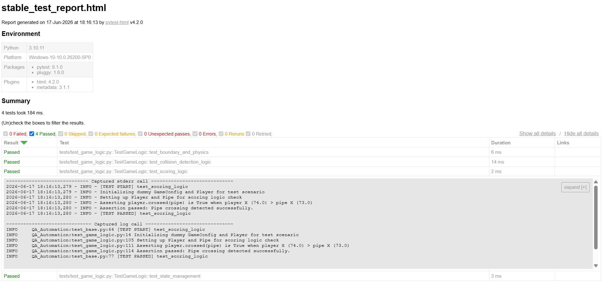
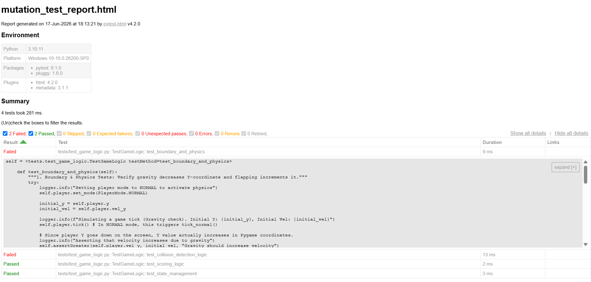

# Flappy Bird Clone - QA Automation Sandbox 🎮🧪

This project is a clone of the popular [FlapPyBird repository](https://github.com/sourabhv/FlapPyBird.git), enhanced with an automated test suite to demonstrate **Game QA Automation** principles.

The core game logic has been isolated and wrapped with automated test frameworks, detailed logging, and HTML reporting to prove build stability and catch regressions headlessly.

---

## 🛠️ Project Setup & Installation

The automation framework and game dependencies are fully optimized for **Python 3.10**. Follow these steps to set up the clean, isolated virtual environment and run the project:

### 1. Initialize Virtual Environment
```powershell
py -3.10 -m venv venv
```

### 2. Activate the Environment
```powershell
.\venv\Scripts\Activate.ps1
```

### 3. Install Dependencies
```powershell
pip install .
pip install pytest pytest-html
```

### 4. Play the Game (Manual Check)
```powershell
python main.py
```


Controls: Use `Space` or `Up Arrow` to jump, `Esc` to close.

---

## 🧪 Run Automated Tests

### Stable Build Validation
To avoid UI flashing and reduce execution overhead during continuous integration, the tests run headlessly using unittest.mock to patch Pygame’s window components globally.
Run the complete test suite against the stable game build using **Pytest**. This generates a detailed, self-contained HTML report for stakeholders.

**Command:**
```powershell
pytest tests/test_game_logic.py --html=reports/stable_test_report.html --self-contained-html
```



**Report Location:**
- `reports/stable_test_report.html`
- **Log File:** `tests/test_run.log`

### 📊 QA Sandbox: Mutation Testing (Simulating a Broken Build)
To demonstrate the test suite's robustness, we intentionally inject bugs into the core game logic. The automated tests should fail when these mutations are introduced.

#### Example Mutation: Broken Flap Mechanics
**File Location:** `src/entities/player.py`

**Mutated Code:**
```python
    def flap(self) -> None:
        if self.y > self.min_y:
            self.vel_y = 0  # INTENTIONAL BUG: flap no longer provides upward velocity (was self.flap_acc)
            self.vel_y = self.flap_acc

    if self.collide(floor):
    if False:  # INTENTIONAL BUG: player ignores floor boundaries entirely    
```

**Verification Command:**
```powershell
pytest tests/test_game_logic.py --html=reports/mutation_test_report.html --self-contained-html
```

**Expected Result:** The test `test_boundary_and_physics` should fail, and the HTML report will show the specific assertion failure, proving that the test suite successfully detected the regression.



**Verification Command:**
```powershell
git checkout src/
```